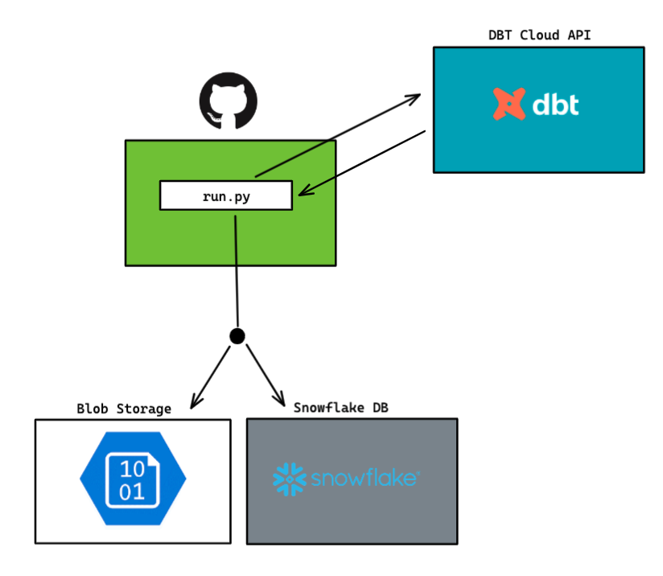

# dbt-cloud-cli
@reidwil Q4 2021/Q1 2022

dbt-cloud-cli is a JetBlue python program that allows users with Jetblue's API key to programmatically interact with dbt, python, snowflake.



### Reasoning

- The data dbt cloud's api exposes gives a direct link between our jetblue-dbt repository and the corresponding snowflake warehouse usage statistics allowing us to effectively bridge an analytical gap between dbt and snowflake.

- The dbt cloud data directly relates to snowflake warehouse usage and potentially optimization opportunities.

- DataOps teams can use a single location to debug dbt errors and freshness alerts.


## Methodology

--------------
This project contains three major classes:
- `DBT` - A connector to dbt cloud using Jetblue's [api key](https://docs.getdbt.com/dbt-cloud/api-v2#section/Authentication)
   - Api key should be stored as an env var named `DBT_API_KEY`
- `SF` - A connector to Jetblue's snowflake instance
   - The default auth is `externalbrower`
- `Blob` - A connection to `jbsaeastus2analyticsdev` blob storage account

At the base of the code, we are simply connecting to dbt cloud using the `requests` library.
```python
import requests
requests.request('GET','https://cloud.getdbt.com/api/v2/accounts/')
```
Once we've verified we are able to talk to the api, we are able to append other endpoints to our "base" url. The two most important endpoints we care about are:
1. [Jobs endpoint](https://docs.getdbt.com/dbt-cloud/api-v2#tag/Jobs) - `https://cloud.getdbt.com/api/v2/accounts/{accountId}/jobs/`
2. [Runs endpoint](https://docs.getdbt.com/dbt-cloud/api-v2#tag/Runs) - `https://cloud.getdbt.com/api/v2/accounts/{accountId}/runs/`

With these end two endpoints we can build the backbone of our dbt class:
```python
class DBT():
    job_url = 'https://cloud.getdbt.com/api/v2/accounts/1234/jobs/'
    run_url = 'https://cloud.getdbt.com/api/v2/accounts/1234/runs/'

    def get_jobs():
        return requests.request('GET', job_url)

    def get_runs():
        return requests.request('GET', run_url)
```


### Examples

### Potential Improvements