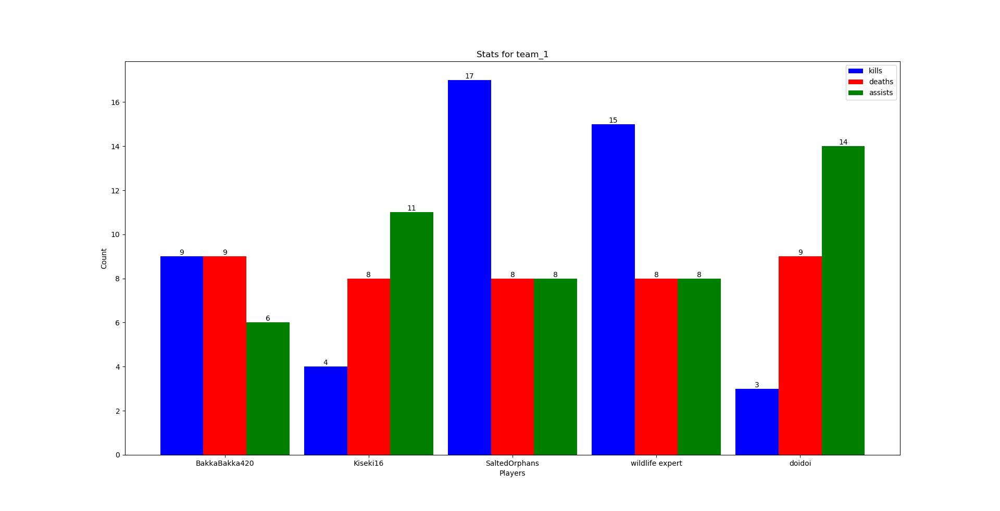
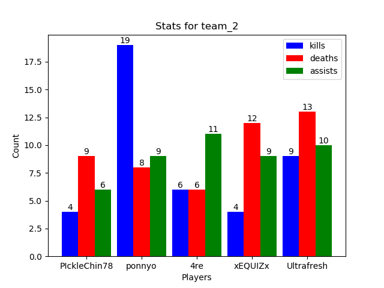

# Riot Apis

## Set up
To run this, one must have a Riot Developer API key [read more here](https://developer.riotgames.com/docs/portal). Once an API key is created, the key should be stored in a file called `.env` at the root of this directory (where this read me is created). 

_Example .env file_
```
RIOT_API_KEY="<YOUR API KEY>"
``` 

If the file is not created or the RIOT_API_KEY is not specified, the programs used will default to asking for the api key as input. 

## Usage

To graph out league of legends games, run this command and follow the prompts:
```bash
$ pip install -r requirements.txt
$ python --version # Python 3.7.3
$ python league_plot.py
```

Running this will generate two plots for both teams within a game like so:



